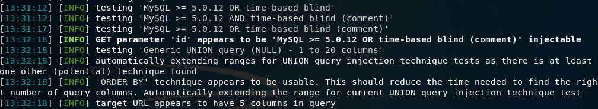
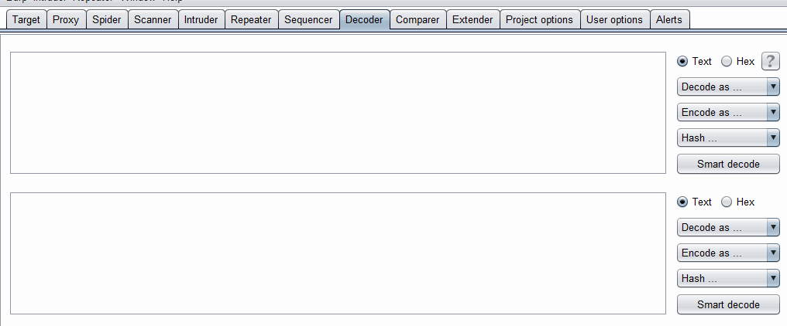
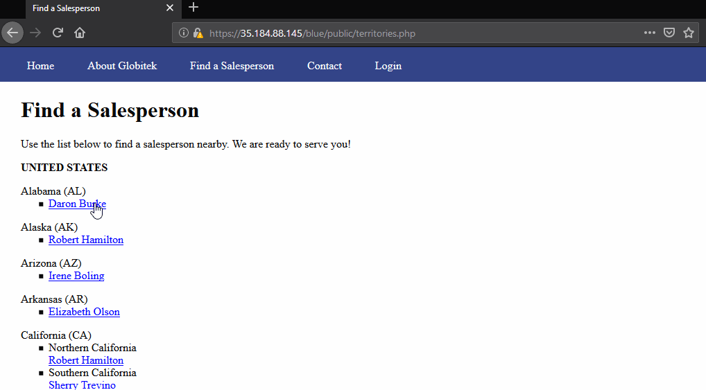

# Project 8 - Pentesting Live Targets

Time spent: **X** hours spent in total

> Objective: Identify vulnerabilities in three different versions of the Globitek website: blue, green, and red.

The six possible exploits are:
* Username Enumeration
* Insecure Direct Object Reference (IDOR)
* SQL Injection (SQLi)
* Cross-Site Scripting (XSS)
* Cross-Site Request Forgery (CSRF)
* Session Hijacking/Fixation

Each version of the site has been given two of the six vulnerabilities. (In other words, all six of the exploits should be assignable to one of the sites.)

## Blue

Vulnerability #1: SQL Injection (SQLi)

An attacker can use the `/public/salesperson.php?id=1` GET request to gain access to the site's database. 

To discover the vulnerability I used SQLMap.

Then, I URL encoded a payload and put the payload into the GET request.

Vulnerability #2: __________________

## Green

Vulnerability #1: Cross-Site Scripting (XSS)

An attacker can perform a cross-site scripting attack in the Feedback textbox of the Contact Us form. Santization of the textbox can prevent this attack.

Vulnerability #2: Username Enumeration

An attacker can create a list of all valid usernames on the server by checking to see if the failed login returns a HTML span class called failed (for an invalid username) or a HTML span class called failure (for a valid username).

## Red

Vulnerability #1: Insecure Direct Object Reference (IDOR)

Vulnerability #2: __________________

## Notes

Describe any challenges encountered while doing the work

